<picture>
  <source media="(prefers-color-scheme: dark)" srcset="assets/banner-dark.svg">
  <source media="(prefers-color-scheme: light)" srcset="assets/banner-light.svg">
  
</picture>

### Hey, I'm Anteneh Demissie

   

Cybersecurity student and aspiring penetration tester. I like to tinker with things: immersive 3D web, browser tools that run entirely on your machine, and AI agents. Most of what I build ships live under [anteneh.tech](https://anteneh.tech).

#### Building

- **[Project Tracker](https://github.com/KiwiC0der/Project-Tracker)**   - Project and task tracker with a tiling dashboard, ten themes, a WebGL prism hero, Supabase accounts, and analytics computed from your own history.
- **[Abeba](https://github.com/KiwiC0der/Abeba)**   - Abeba (አበባ, "flower"): a calm wellness PWA where a living forest grows from your journaling, photos, voice notes, and time outside.
- **[Motion Studio](https://github.com/KiwiC0der/motion-studio)**   - Control time with your hands. Pinch to scrub a flower's bloom, shape a machine-vision HUD, or conduct a particle field with real-time hand tracking in the browser.
- **[The Game Library](https://github.com/KiwiC0der/Games)**   - A shelf of browser games, starting with Cleo: Celestial Survivor, a roguelite with 770 abilities and relics and 340 foes. No install, no accounts.
- **[Asset Library](https://github.com/KiwiC0der/AssetLibrary)**   - Interactive WebGL grid of visual sketches and downloadable glTF/GLB models with a full-screen viewer (orbit, wireframe, environment lighting).

#### Experiments & Tools

- **[Second Brain Galaxy](https://github.com/KiwiC0der/SecondBrain)**  - Turns an Obsidian vault into a painterly 3D galaxy. Every note is a star, every `[[wikilink]]` a connection, and you fly through it as Cleo.
- **[Chrome Extensions](https://github.com/KiwiC0der/Chrome-Extensions)**  - Manifest V3 extensions built for real work: Media Extractor (DOM + network, HLS reassembly), Transcriber (local Whisper via WASM), and Notebook Tools. No accounts, no telemetry.
- **[Bot](https://github.com/KiwiC0der/Bot)**  - Runbooks and helper scripts for operating a self-hosted OpenClaw agent on Kali + Docker / WSL2: gateway, Telegram, email, voice, web tools, and a hardening backlog.

*Last updated: 2026-09-14*
